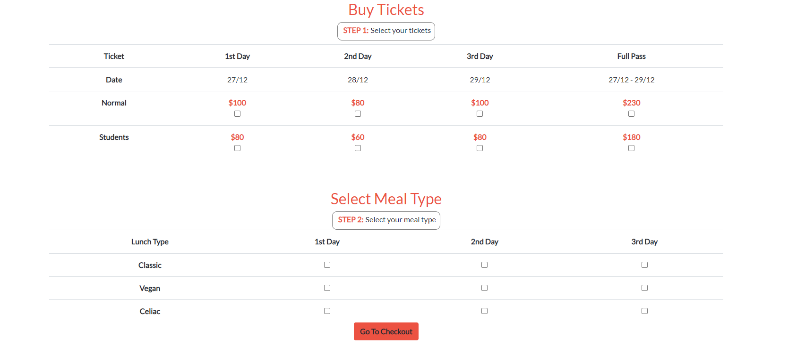

# Electro Swing Thing - 2020

A fully responsive website for a Music Festival, with the main page, the ticket buying section and the 'About us' section.

1. Desktop Version

2. Mobile Version

This Project is a variation of a Creative Commons Global Summit design, it consists of a conference page that has a main page, another page where you can buy tickets for the conference, and the 'About us' page that further describes the event.

Instead of a Conference, I designed the website to be for a music festival, the color palette was mostly respected but little tweaks where done to some parts of the design.

The website was mainly built using Bootstrap4 and some stylings were given with plain CSS.

## Video Description

- [Watch Video](https://www.loom.com/share/a665af9f3cf6497286d979cb264323fb)

## Live Demo

- [Visit Page](https://rawcdn.githack.com/KennyUTN/Html-Capstone-Project-Kenny/562938d8cbd815f78ee855f750d87c746349ce82/index.html)

## Built With

- HTML5
- Bootstrap4
- CSS3

## Author

👤 **Ignacio Asis**

- Github: [@KennyUTN](https://github.com/KennyUTN)
- Twitter: [@Kenny11614766](https://twitter.com/Kenny11614766)
- Linkedin: [linkedin](https://www.linkedin.com/in/ignacio-asis-b8214b183/)

## 🤝 Contributing

Contributions, issues, and feature requests are welcome!

Feel free to check the [issues page](https://github.com/KennyUTN/Html-Capstone-Project-Kenny/issues) if you want to contribute

## Show your support

Give a ⭐️ if you like this project!

## 📝 License

This work is licensed under a
[Creative Commons Attribution-ShareAlike 4.0 International License][cc-by-sa].

[![CC BY-SA 4.0][cc-by-sa-image]][cc-by-sa]

[cc-by-sa]: http://creativecommons.org/licenses/by-sa/4.0/
[cc-by-sa-image]: https://licensebuttons.net/l/by-sa/4.0/88x31.png
[cc-by-sa-shield]: https://img.shields.io/badge/License-CC%20BY--SA%204.0-lightgrey.svg
